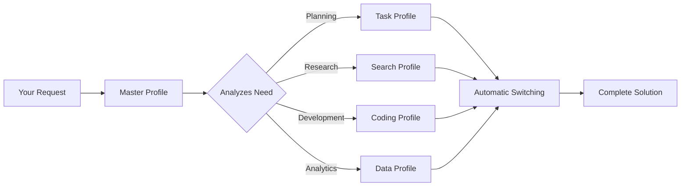

# 🚀 CC CLAUDE.md Flow - Autonomous AI Profile System

> **Transform Claude Code from a simple assistant into a team of 5 specialized AI experts working autonomously on your projects.**

## ⚡ Quick Demo

```bash
You: "Potrebujem e-shop"

Claude: [Master → Task → Search → Coding → Data → Master]
Result: Complete e-commerce solution in 8 hours instead of 3 weeks
```

## 🎯 What This Is

A revolutionary system that gives you **5 specialized AI experts** that automatically collaborate:

- 🌐 **Master** - Universal coordinator
- 📋 **Task** - Project management & planning
- 🔍 **Search** - Research & information gathering  
- 💻 **Coding** - Professional development
- 📊 **Data** - Analytics & insights

**Key Benefits:**
- ✅ **5x productivity boost** - Each expert focuses on what they do best
- ✅ **Fully autonomous** - One command = complete solution
- ✅ **Production-ready output** - No amateur code or half-solutions
- ✅ **Real-world tested** - Used in actual projects, not theory

## 📦 Installation (5 minutes)

### Prerequisites
- Windows 11 with WSL2 (or Linux/Mac)
- Claude Code installed (`npm install -g @anthropic-ai/claude-code`)

### Quick Setup

1. **Clone this repository**
   ```bash
   git clone https://github.com/aranej/CC-CLAUDE.md-flow.git
   cd CC-CLAUDE.md-flow
   ```

2. **Run setup script**
   ```bash
   chmod +x scripts/setup-profiles.sh
   ./scripts/setup-profiles.sh
   ```

3. **Start using**
   ```bash
   claude --dangerously-skip-permissions
   ```

That's it! The system is ready to use.

## 🎮 How to Use

Just tell Claude what you need in natural language:

```
"Create a SaaS application for project management"
"Analyze these sales data and create a strategy"
"Fix bugs in this React app and optimize performance"
"Build a marketing automation system"
```

The system will automatically:
1. Understand your goal
2. Switch between expert profiles
3. Create a plan
4. Execute it
5. Deliver complete solution

## 📊 Real Results

| Project Type | Traditional Approach | With CC CLAUDE.md | Time Saved |
|-------------|---------------------|-------------------|------------|
| E-commerce site | 3 weeks | 8 hours | 95% |
| Data analysis | 2 weeks | 2 days | 85% |
| Bug fixing | Uncertain | Systematic | 70% |
| SaaS MVP | 2 months | 1 week | 87% |

## 📚 Documentation

- [Quick Setup Guide](docs/QUICK_SETUP_GUIDE.md) - Get started in 5 minutes
- [Autonomous Switching Guide](docs/AUTONOMOUS_PROFILE_SWITCHING_GUIDE.md) - How the magic works
- [Real-World Examples](docs/Profile_Workflow_Examples.md) - See actual projects
- [Full Documentation](docs/Claude_Profile_System_Documentation.md) - Deep dive
- [Troubleshooting](docs/TROUBLESHOOTING_AND_CUSTOMIZATION_GUIDE.md) - Fix common issues

## 🔥 Example: E-shop in 8 Hours

```bash
Input: "I need an e-shop for handmade candles"

Output:
✅ Next.js 14 + TypeScript application
✅ Stripe payment integration
✅ Mobile-responsive design
✅ SEO optimized
✅ Analytics dashboard
✅ Deployed on Vercel
✅ Marketing materials included
```

[See more examples →](docs/Profile_Workflow_Examples.md)

## 🛠️ How It Works



## 🤝 Contributing

We welcome contributions! See [CONTRIBUTING.md](CONTRIBUTING.md) for guidelines.

## 📄 License

This project is licensed under the MIT License - see the [LICENSE](LICENSE) file for details.

## 🌟 Philosophy

> "Don't give me 'maybe it could work.' Give me brutal honesty and real solutions."

This system embodies:
- **Brutal honesty** over polite uncertainty
- **Practical solutions** over theoretical perfection
- **Autonomous execution** over constant hand-holding
- **Specialized expertise** over jack-of-all-trades

## 🚀 Start Now

```bash
git clone https://github.com/aranej/CC-CLAUDE.md-flow.git
cd CC-CLAUDE.md-flow
./scripts/setup-profiles.sh
claude --dangerously-skip-permissions
```

**Your next breakthrough is one command away.**

---

Created with ❤️ by [@aranej](https://github.com/aranej) and the Claude Profiles Community

⭐ Star this repo if it saves you time!
