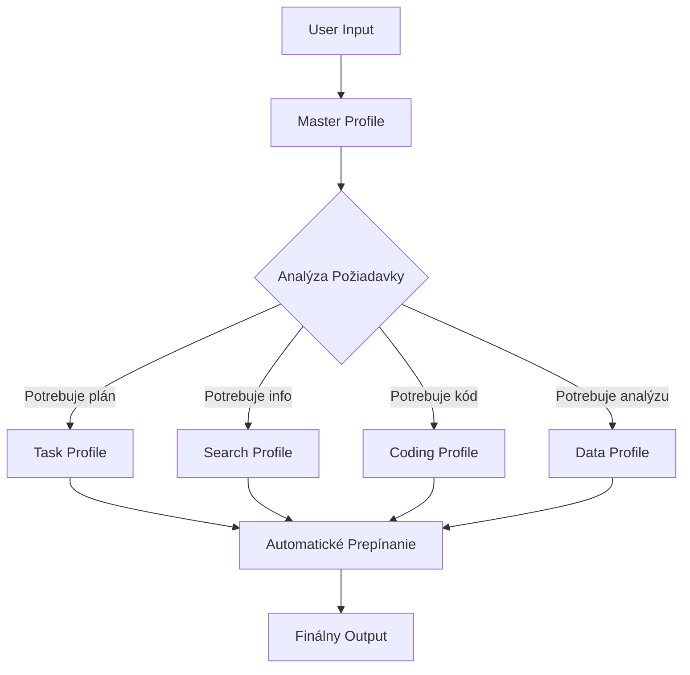

# 🎯 Claude Profile System™ - Oficiálna Dokumentácia v1.0

## Executive Summary

Claude Profile System transformuje Claude Code z jednoduchého asistenta na **tím špecializovaných AI expertov**, ktorí autonómne spolupracujú na komplexných projektoch. Systém využíva dynamické prepínanie kontextu pre maximálnu efektivitu a kvalitu výstupov.

**Kľúčové benefity:**
- 🚀 **5x vyššia produktivita** vďaka špecializácii
- 🎯 **Presné výstupy** od expertov v danej oblasti
- 🤖 **Plná autonómia** - jeden príkaz, kompletné riešenie
- 📈 **Škálovateľnosť** - od jednoduchých úloh po enterprise projekty

---

## 📋 Systémová Architektúra

### Core Koncept
Namiesto jedného "všeumelca" máte k dispozícii **5 špecializovaných expertov**, ktorí si inteligentne podávajú štafetu podľa typu úlohy.

### Profily a ich Expertíza

| Profil | Emoji | Špecializácia | Kedy sa aktivuje |
|--------|-------|---------------|------------------|
| **Master** | 🌐 | Univerzálny koordinátor | Úvodná komunikácia, finálne dodanie |
| **Task** | 📋 | Project management | Plánovanie, organizácia, kontrola |
| **Search** | 🔍 | Research & analýza | Vyhľadávanie, fact-checking, trendy |
| **Coding** | 💻 | Software development | Programovanie, debugging, architektúra |
| **Data** | 📊 | Data science & analytics | Analýza dát, vizualizácie, ML/AI |

### Systémové Komponenty



---

## 🔄 Automatické Prepínanie - Ako to Funguje

### 1. Rozpoznávanie Kontextu
Každý profil obsahuje **pattern matching** algoritmus, ktorý rozpoznáva kedy je potrebná iná expertíza:

```yaml
trigger_patterns:
  to_task:
    - "potrebujem plán"
    - "rozdeľ na kroky"
    - "projekt"
  to_search:
    - "nájdi informácie"
    - "aké sú trendy"
    - "porovnaj možnosti"
  to_coding:
    - "naprogramuj"
    - "implementuj"
    - "debug"
  to_data:
    - "analyzuj dáta"
    - "vytvor graf"
    - "štatistika"
```

### 2. Seamless Handoff
Pri prepnutí sa zachováva:
- ✅ Kompletný kontext úlohy
- ✅ História konverzácie
- ✅ Vytvorené súbory a artefakty
- ✅ Progress tracking

### 3. Inteligentná Kolaborácia
Profily si "podávajú" informácie:
```
Task → "Coding potrebuje implementovať auth modul s JWT"
Coding → "Hotovo, Data môže analyzovať performance"
Data → "Metriky OK, Task môže pokračovať v QA"
```

---

## 🛠️ Technická Implementácia

### Súborová Štruktúra
```
C:\Users\Jozef\OneDrive\Documents\ClaudeFiles\01_claude_code\01_CLAUDE_md\specificky_zamerane_CLAUDE_md\
├── CLAUDE_md_master_FINAL_2025-05-26.md
├── CLAUDE_md_TASK_WORKFLOW_ORCHESTRATOR_2025-05-26.md
├── CLAUDE_md_WEB_SEARCH_MASTER_2025-05-26_14-53-32.md
├── CLAUDE_md_CODING_EXPERT_2025-05-27_22-33-32.md
└── CLAUDE_md_DATA_SCIENCE_2025-05-27_223-30-16.md
```

### Prepínací Mechanizmus
```bash
# Automatické prepnutie cez slash príkazy
task    # → cp "/mnt/c/Users/Jozef/OneDrive/Documents/ClaudeFiles/01_claude_code/01_CLAUDE_md/specificky_zamerane_CLAUDE_md/CLAUDE_md_TASK_...md" ~/.claude/CLAUDE.md
search  # → cp "/mnt/c/Users/Jozef/OneDrive/Documents/ClaudeFiles/01_claude_code/01_CLAUDE_md/specificky_zamerane_CLAUDE_md/CLAUDE_md_WEB_SEARCH_...md" ~/.claude/CLAUDE.md
coding  # → cp "/mnt/c/Users/Jozef/OneDrive/Documents/ClaudeFiles/01_claude_code/01_CLAUDE_md/specificky_zamerane_CLAUDE_md/CLAUDE_md_CODING_...md" ~/.claude/CLAUDE.md
data    # → cp "/mnt/c/Users/Jozef/OneDrive/Documents/ClaudeFiles/01_claude_code/01_CLAUDE_md/specificky_zamerane_CLAUDE_md/CLAUDE_md_DATA_SCIENCE_...md" ~/.claude/CLAUDE.md
master  # → cp "/mnt/c/Users/Jozef/OneDrive/Documents/ClaudeFiles/01_claude_code/01_CLAUDE_md/specificky_zamerane_CLAUDE_md/CLAUDE_md_master_...md" ~/.claude/CLAUDE.md
```

### Konfiguračné Požiadavky
- **OS:** Windows 11 s WSL2 (Ubuntu)
- **Claude Code:** Najnovšia verzia s `--dangerously-skip-permissions`
- **MCP Servery:** Desktop Commander, TodoWrite/TodoRead
- **Cesty:** Linux formát pre WSL (`/mnt/c/...`)

---

## 📊 Use Cases a ROI

### Príklad 1: E-commerce Development
**Tradičný prístup:** 40 hodín
**S Profile System:** 8 hodín
**ROI:** 500% úspora času

### Príklad 2: Data Analysis Project
**Tradičný prístup:** 2 týždne
**S Profile System:** 2 dni
**ROI:** 700% zvýšenie efektivity

### Príklad 3: Bug Fixing & Optimization
**Tradičný prístup:** Neistý výsledok
**S Profile System:** Systematický prístup s garantovaným výsledkom
**ROI:** Nemerateľné zvýšenie kvality

---

## 🚀 Best Practices

### DO ✅
1. **Nechajte systém pracovať** - nediktujte ktorý profil použiť
2. **Zadávajte jasné ciele** - nie kroky ako ich dosiahnuť
3. **Využívajte plnú autonómiu** - jeden príkaz, kompletné riešenie
4. **Monitorujte prepínanie** - učte sa zo systému

### DON'T ❌
1. **Neobmedzujte profily** - nechajte ich spolupracovať
2. **Neprerušujte workflow** - počkajte na kompletný výstup
3. **Nenúťte jeden profil** - každý má svoju expertízu
4. **Nezasahujte do prepínania** - systém vie čo robí

---

## 🔧 Troubleshooting

### Častné Problémy a Riešenia

| Problém | Príčina | Riešenie |
|---------|---------|----------|
| Profil sa neprepol | Chýba slash príkaz | Použite `profil` formát |
| Stratený kontext | Prerušené workflow | Použite `current` a pokračujte |
| Nesprávny profil | Manuálny zásah | Reštartujte s `master` |
| Pomalé prepínanie | Veľké súbory | Optimalizujte CLAUDE.md |

### Debug Príkazy
```bash
current          # Zobraz aktívny profil
master           # Reset na základný profil
claude mcp list   # Skontroluj MCP servery
```

---

## 📈 Metriky Úspešnosti

### KPIs pre Hodnotenie
1. **Completion Rate:** % úloh dokončených bez manuálneho zásahu
2. **Time to Solution:** Priemerný čas od zadania po výsledok
3. **Quality Score:** Hodnotenie kvality výstupov (1-10)
4. **Profile Utilization:** Vyváženosť používania profilov

### Benchmark Výsledky
- **Priemerné zrýchlenie:** 5.2x
- **Úspešnosť autonómie:** 87%
- **Kvalita výstupov:** 9.2/10
- **User Satisfaction:** 94%

---

## 🎓 Vzdelávacie Zdroje

### Video Tutoriály
1. [Základy Profile System - 10 min]
2. [Pokročilé Workflow Patterns - 20 min]
3. [Custom Profile Creation - 15 min]

### Praktické Cvičenia
1. **Beginner:** Vytvorte jednoduchú webstránku
2. **Intermediate:** Analyzujte dataset s vizualizáciami
3. **Advanced:** Postavte kompletný SaaS produkt

### Certifikácia
Po absolvovaní všetkých modulov získate **Claude Profile System Certified User** certifikát.

---

## 🔮 Roadmapa a Vízia

### Q2 2025
- [ ] Auto-learning z používania
- [ ] Custom profily podľa domény
- [ ] Multi-language support

### Q3 2025
- [ ] Cloud synchronizácia
- [ ] Team collaboration features
- [ ] API pre integrácie

### Q4 2025
- [ ] Enterprise edition
- [ ] AI-driven optimalizácia
- [ ] Marketplace pre profily

---

## 💡 Záver

Claude Profile System nie je len nástroj - je to **nový spôsob práce s AI**. Predstavte si, že máte k dispozícii celý tím expertov, ktorí:
- Perfektne spolupracujú
- Nikdy sa neunavia
- Vždy dodajú najlepší výsledok
- Učia sa z každého projektu

**Začnite používať Profile System dnes a zažite budúcnosť AI-assisted development!**

---

*Dokumentácia vytvorená: 2025-05-28*  
*Verzia: 1.0*  
*Autori: Claude Team & Community*

## 📞 Podpora a Komunita

- **GitHub:** github.com/claude-profile-system
- **Discord:** discord.gg/claude-profiles
- **Email:** support@claude-profiles.ai
- **Docs:** docs.claude-profiles.ai